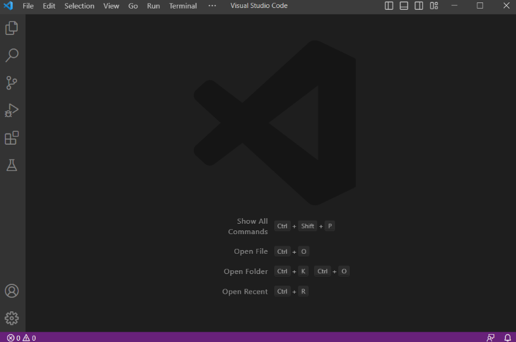

# **Lab Report 1 - Remote Access and FileSystem**
Hello!

This is a tutorial for CSE 15L students for how to log into a course-specific account on **ieng6**.

## Step 1 - Finding your CSE15L Account

Your account username should be in the form `cs15lsp23zz` where the "zz"'s are specific to your account.

Follow this link: [Account Lookup](https://sdacs.ucsd.edu/~icc/index.php). If you've already reset your password, great! 

If not, here's a tutorial: [How to Change Password](https://drive.google.com/file/d/17IDZn8Qq7Q0RkYMxdiIR0o6HJ3B5YqSW/view?usp=share_link)

**Write down your password! You'll need it later!**

## Step 2 - Download Visual Studio Code

I personally already had this code editor for CSE 11, so I didn't need to download it. 

However, if you don't have it downloaded already here's the link: [VSCode](https://code.visualstudio.com/) and follow its directions.

After it's installed, it should look like this:

